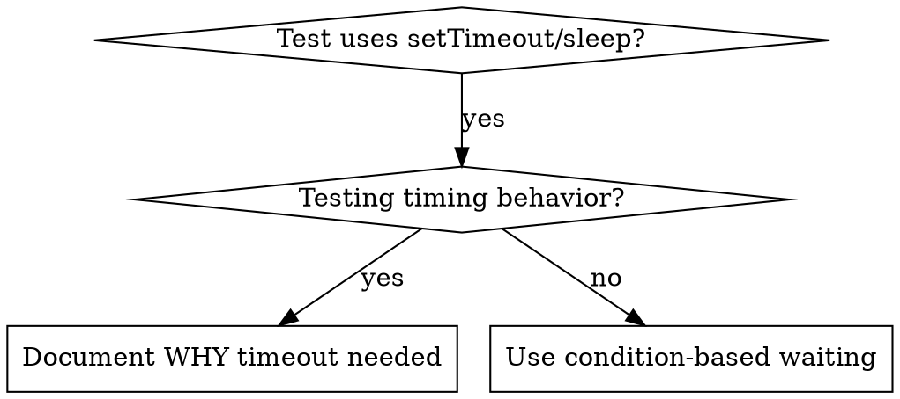

# Condition-Based Waiting

## Overview

Flaky tests often guess at timing with arbitrary delays. This creates race conditions where tests pass on fast machines but fail under load or in CI.

**Core principle:** Wait for the actual condition you care about, not a guess about how long it takes.

## When to Use



**Use when:**
- Tests have arbitrary delays (`setTimeout`, `sleep`, `time.sleep()`)
- Tests are flaky (pass sometimes, fail under load)
- Tests timeout when run in parallel
- Waiting for async operations to complete

**Don't use when:**
- Testing actual timing behavior (debounce, throttle intervals)
- Always document WHY if using arbitrary timeout

## Core Pattern

```csharp
// ❌ BEFORE: Guessing at timing
await Task.Delay(50);
var result = GetResult();
Assert.NotNull(result);

// ✅ AFTER: Waiting for condition
await WaitForAsync(() => GetResult() != null);
var result = GetResult();
Assert.NotNull(result);
```

## Quick Patterns

| Scenario | Pattern |
|----------|---------|
| Wait for event | `WaitForAsync(() => events.Any(e => e.Type == "DONE"))` |
| Wait for state | `WaitForAsync(() => machine.State == "ready")` |
| Wait for count | `WaitForAsync(() => items.Count >= 5)` |
| Wait for file | `WaitForAsync(() => File.Exists(path))` |
| Complex condition | `WaitForAsync(() => obj.Ready && obj.Value > 10)` |

## Implementation

Generic polling function:
```csharp
public static async Task<T> WaitForAsync<T>(
    Func<T?> condition,
    string description,
    int timeoutMs = 5000)
    where T : class
{
    var startTime = DateTime.UtcNow;

    while (true)
    {
        var result = condition();
        if (result != null) return result;

        if ((DateTime.UtcNow - startTime).TotalMilliseconds > timeoutMs)
        {
            throw new TimeoutException($"Timeout waiting for {description} after {timeoutMs}ms");
        }

        await Task.Delay(10); // Poll every 10ms
    }
}
```

See `ConditionBasedWaitingExample.cs` in this directory for complete implementation with domain-specific helpers (`WaitForEventAsync`, `WaitForEventCountAsync`, `WaitForEventMatchAsync`) from actual debugging session.

## Common Mistakes

**❌ Polling too fast:** `setTimeout(check, 1)` - wastes CPU
**✅ Fix:** Poll every 10ms

**❌ No timeout:** Loop forever if condition never met
**✅ Fix:** Always include timeout with clear error

**❌ Stale data:** Cache state before loop
**✅ Fix:** Call getter inside loop for fresh data

## When Arbitrary Timeout IS Correct

```csharp
// Tool ticks every 100ms - need 2 ticks to verify partial output
await WaitForEventAsync(manager, "TOOL_STARTED"); // First: wait for condition
await Task.Delay(200);   // Then: wait for timed behavior
// 200ms = 2 ticks at 100ms intervals - documented and justified
```

**Requirements:**
1. First wait for triggering condition
2. Based on known timing (not guessing)
3. Comment explaining WHY

## Real-World Impact

From debugging session (2025-10-03):
- Fixed 15 flaky tests across 3 files
- Pass rate: 60% → 100%
- Execution time: 40% faster
- No more race conditions
