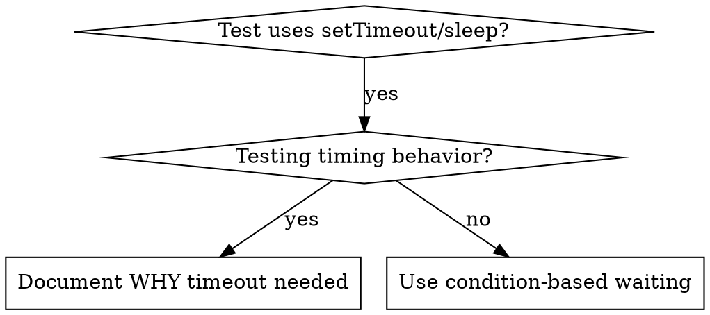

# Condition-Based Waiting

## Overview

Flaky tests often guess at timing with arbitrary delays. This creates race conditions where tests pass on fast machines but fail under load or in CI.

**Core principle:** Wait for the actual condition you care about, not a guess about how long it takes.

## When to Use



**Use when:**
- Tests have arbitrary delays (`setTimeout`, `sleep`, `time.sleep()`)
- Tests are flaky (pass sometimes, fail under load)
- Tests timeout when run in parallel
- Waiting for async operations to complete

**Don't use when:**
- Testing actual timing behavior (debounce, throttle intervals)
- Always document WHY if using arbitrary timeout

## Core Pattern

```java
// ❌ BEFORE: Guessing at timing
Thread.sleep(50);
var result = getResult();
assertThat(result).isNotNull();

// ✅ AFTER: Waiting for condition (using Awaitility)
await().atMost(5, SECONDS).until(() -> getResult() != null);
var result = getResult();
assertThat(result).isNotNull();
```

## Quick Patterns

| Scenario | Pattern |
|----------|---------|
| Wait for event | `await().until(() -> events.stream().anyMatch(e -> e.getType().equals("DONE")))` |
| Wait for state | `await().until(() -> machine.getState().equals("ready"))` |
| Wait for count | `await().until(() -> items.size() >= 5)` |
| Wait for file | `await().until(() -> Files.exists(Path.of(path)))` |
| Complex condition | `await().until(() -> obj.isReady() && obj.getValue() > 10)` |

## Implementation

Generic polling function:
```java
public static <T> T waitFor(
        Supplier<T> condition,
        String description,
        Duration timeout) {
    long startTime = System.currentTimeMillis();
    long timeoutMs = timeout.toMillis();

    while (true) {
        T result = condition.get();
        if (result != null) return result;

        if (System.currentTimeMillis() - startTime > timeoutMs) {
            throw new TimeoutException(
                String.format("Timeout waiting for %s after %dms", description, timeoutMs));
        }

        Thread.sleep(10); // Poll every 10ms
    }
}

// Or simply use Awaitility:
await().atMost(5, SECONDS)
       .pollInterval(10, MILLISECONDS)
       .until(condition);
```

See `ConditionBasedWaitingExample.java` in this directory for complete implementation with domain-specific helpers (`waitForEvent`, `waitForEventCount`, `waitForEventMatch`) from actual debugging session. For Spring Boot tests, consider using `Awaitility` library.

## Common Mistakes

**❌ Polling too fast:** `setTimeout(check, 1)` - wastes CPU
**✅ Fix:** Poll every 10ms

**❌ No timeout:** Loop forever if condition never met
**✅ Fix:** Always include timeout with clear error

**❌ Stale data:** Cache state before loop
**✅ Fix:** Call getter inside loop for fresh data

## When Arbitrary Timeout IS Correct

```java
// Tool ticks every 100ms - need 2 ticks to verify partial output
await().until(() -> manager.hasEvent("TOOL_STARTED")); // First: wait for condition
Thread.sleep(200);   // Then: wait for timed behavior
// 200ms = 2 ticks at 100ms intervals - documented and justified
```

**Requirements:**
1. First wait for triggering condition
2. Based on known timing (not guessing)
3. Comment explaining WHY

## Real-World Impact

From debugging session (2025-10-03):
- Fixed 15 flaky tests across 3 files
- Pass rate: 60% → 100%
- Execution time: 40% faster
- No more race conditions
